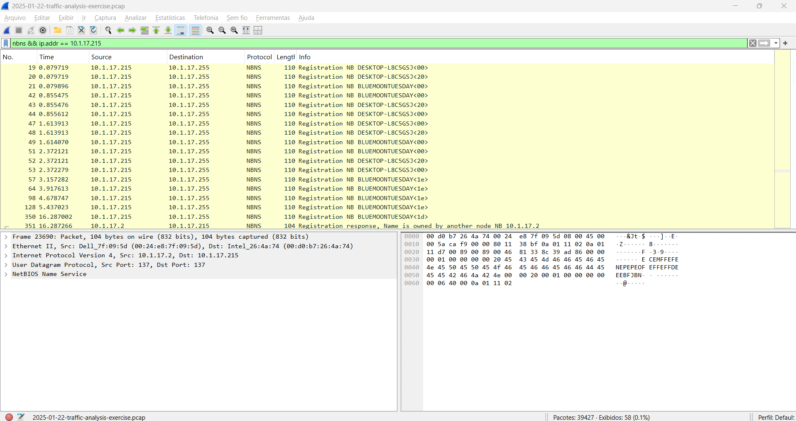
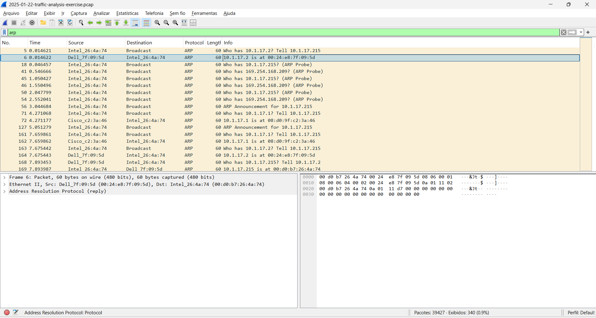
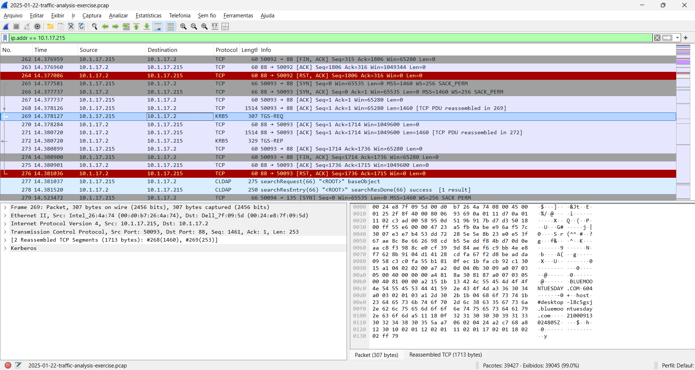
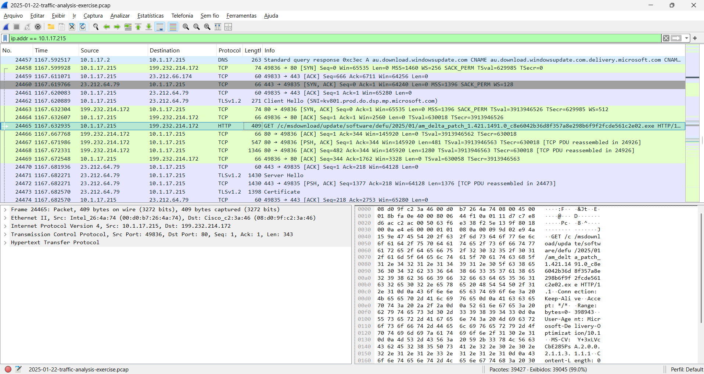

### Network Forensics Report – Case 01: Fake Software Malware

---

### Overview

This analysis investigates suspicious network activity captured in a `.pcap` file.  
The objective is to identify potential malicious behavior, focusing on:

- Host identification  
- Network communication  
- Authentication activity  
- Suspicious downloads  

---

### Identified Hosts

Through NBNS (NetBIOS Name Service), we identified the hostname associated with the IP:

- Hostname: BLUEMOONTUESDAY  
- IP Address: 10.1.17.215  

Additionally, a conflict was observed with:

- IP: 10.1.17.2  

This suggests another device responding to the same NetBIOS name, which may indicate misconfiguration or potential spoofing.

---

### Network Analysis

ARP traffic was analyzed to map IP addresses to MAC addresses within the network.

Findings:
- 10.1.17.215 → 00:d0:b7:26:4a:74  
- 10.1.17.2 → 00:24:e8:7f:09:5d  

This confirms communication between two internal hosts and helps establish the network context.

---

### Authentication Activity (Kerberos)

Kerberos (KRB5) traffic was observed between:

- Client: 10.1.17.215  
- Server: 10.1.17.2  

Captured events:
- TGS-REQ (Ticket Granting Service Request)  
- TGS-REP (Ticket Granting Service Response)  

This indicates domain-based authentication, typical of Active Directory environments.  
No anomalies were detected in the authentication flow itself.

---

### Suspicious Activity

An HTTP request over port 80 was identified:

- Source: 10.1.17.215  
- Destination: 199.232.214.172  
- Protocol: HTTP  
- Method: GET  

The request downloads an executable file:
/msdownload/update/software/defu/.../am_delta_patch_*.exe

Key observations:
- File type: `.exe` (executable)  
- Download over HTTP (no encryption)  
- External IP communication  

This behavior is consistent with potential malware delivery or unauthorized software installation.

---

### DNS Analysis (Supporting Evidence)

DNS queries show resolution of Microsoft-related domains such as:

- `download.windowsupdate.com`  
- `msftconnecttest.com`  

This may indicate legitimate traffic; however, malware often mimics trusted domains to evade detection.

No definitive malicious domain was identified, but the timing correlates with the suspicious download.

---

### Conclusion

The investigation identified the following:

- Internal host: **BLUEMOONTUESDAY (10.1.17.215)**  
- Communication with another internal system (10.1.17.2)  
- Normal Kerberos authentication activity  
- A suspicious HTTP download of an executable file  

### Final Assessment

The most critical finding is the download of an executable file over HTTP, which may indicate:

- Malware infection vector  
- Unauthorized software installation  
- Potential compromise of the host  

Further analysis is recommended, including:

- File hash verification  
- Endpoint inspection  
- SIEM log correlation  
- Antivirus or sandbox analysis  

---

### Environment

This analysis was conducted in a controlled lab environment using a pre-captured network traffic file (`.pcap`) provided for forensic investigation purposes.

The environment simulates a corporate network scenario, including:
- Internal hosts communicating within a private IP range (10.1.17.0/24)
- Active Directory-related services (e.g., Kerberos, NBNS)
- External network communication over HTTP

As this is a simulated dataset, some traffic (such as Windows Update requests) may represent benign background activity. However, the goal is to identify patterns and behaviors consistent with real-world threats.
