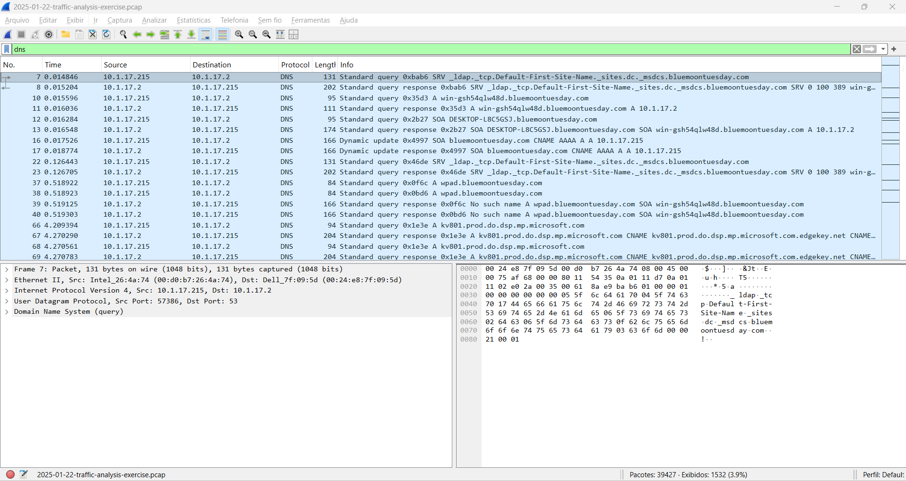

### Network Forensics Report – Case 01: Fake Software Malware

---

### Overview

This analysis investigates suspicious network activity captured in a `.pcap` file.  
The objective is to identify potential malicious behavior, focusing on:

- Host identification  
- Network communication  
- Authentication activity  
- Suspicious downloads  

---

### Environment

This analysis was conducted in a controlled lab environment using a pre-captured network traffic file (`.pcap`) provided for forensic investigation purposes.

The environment simulates a corporate network scenario, including:
- Internal hosts communicating within a private IP range (10.1.17.0/24)
- Active Directory-related services (e.g., Kerberos, NBNS)
- External network communication over HTTP

As this is a simulated dataset, some traffic (such as Windows Update requests) may represent benign background activity. However, the goal is to identify patterns and behaviors consistent with real-world threats.

---

### Identified Hosts

Through NBNS (NetBIOS Name Service), we identified the hostname associated with the IP:

- Hostname: BLUEMOONTUESDAY  
- IP Address: 10.1.17.215  

Additionally, a conflict was observed with:

- IP: 10.1.17.2  

This suggests another device responding to the same NetBIOS name, which may indicate misconfiguration or potential spoofing.

---

### Network Analysis

ARP traffic was analyzed to map IP addresses to MAC addresses within the network.

Findings:
- 10.1.17.215 → 00:d0:b7:26:4a:74  
- 10.1.17.2 → 00:24:e8:7f:09:5d  

This confirms communication between two internal hosts and helps establish the network context.

---

### Authentication Activity (Kerberos)

Kerberos (KRB5) traffic was observed between:

- Client: 10.1.17.215  
- Server: 10.1.17.2  

Captured events:
- TGS-REQ (Ticket Granting Service Request)  
- TGS-REP (Ticket Granting Service Response)  

This indicates domain-based authentication, typical of Active Directory environments.  
No anomalies were detected in the authentication flow itself, indicating normal domain authentication behavior rather than credential abuse.

---

### Suspicious Activity

An HTTP request over port 80 was identified:

- Source: 10.1.17.215  
- Destination: 199.232.214.172  
- Protocol: HTTP  
- Method: GET  

The request downloads an executable file:
/msdownload/update/software/defu/.../am_delta_patch_*.exe

This behavior aligns with common malware delivery techniques, where attackers distribute malicious executables disguised as legitimate software updates.

Key observations:
- File type: `.exe` (executable)  
- Download over HTTP (no encryption)  
- External IP communication  

This behavior is consistent with potential malware delivery or unauthorized software installation.  
This type of activity is commonly associated with initial access or malware delivery stages in cyber attacks.

---

### DNS Analysis (Supporting Evidence)

DNS queries show resolution of Microsoft-related domains such as:

- `download.windowsupdate.com`  
- `msftconnecttest.com`  

This may indicate legitimate traffic; however, malware often mimics trusted domains to evade detection.

No definitive malicious domain was identified, but the timing correlates with the suspicious download.  
This DNS activity supports the presence of a domain-controlled environment and helps explain the observed Kerberos authentication traffic.  
This behavior may indicate the use of legitimate infrastructure to disguise malicious activity, a common technique used in malware campaigns.

---

### Conclusion

The investigation identified the following:

- Internal host: **BLUEMOONTUESDAY (10.1.17.215)**  
- Communication with another internal system (10.1.17.2)  
- Normal Kerberos authentication activity  
- A suspicious HTTP download of an executable file  

---

### Final Assessment

The evidence suggests that the host 10.1.17.215 performed an HTTP download of an executable file from an external source.

Although the request path resembles a legitimate Microsoft update, the use of unencrypted HTTP introduces risk, as this method could be abused for malware delivery via spoofed or compromised infrastructure.

Given the context of the investigation (fake software download scenario), this activity should be treated as suspicious and potentially malicious until proven otherwise.

---

### Recommendations

- Enforce HTTPS for all outbound traffic  
- Block or monitor HTTP downloads of executable files  
- Inspect the downloaded file (hash analysis / sandboxing)  
- Monitor endpoint behavior for signs of compromise  
- Correlate findings with SIEM logs  
- Implement endpoint detection and response (EDR) tools  

---

### Environment

This analysis was conducted in a controlled lab environment using a pre-captured network traffic file (`.pcap`) provided for forensic investigation purposes.

The environment simulates a corporate network scenario, including:
- Internal hosts communicating within a private IP range (10.1.17.0/24)
- Active Directory-related services (e.g., Kerberos, NBNS)
- External network communication over HTTP

As this is a simulated dataset, some traffic (such as Windows Update requests) may represent benign background activity. However, the goal is to identify patterns and behaviors consistent with real-world threats.
